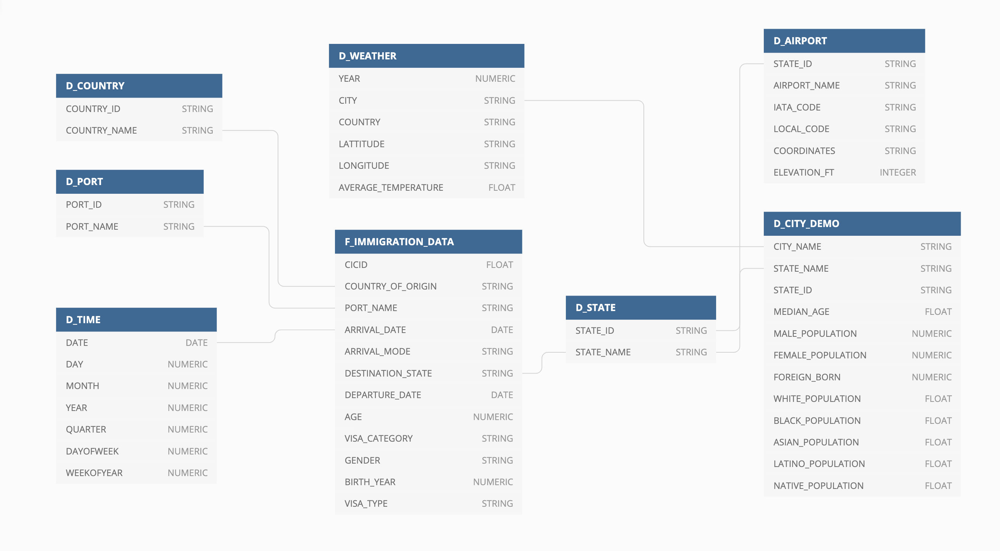
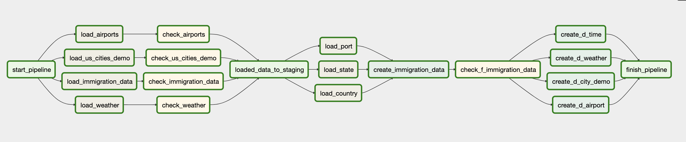
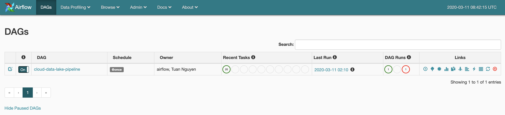
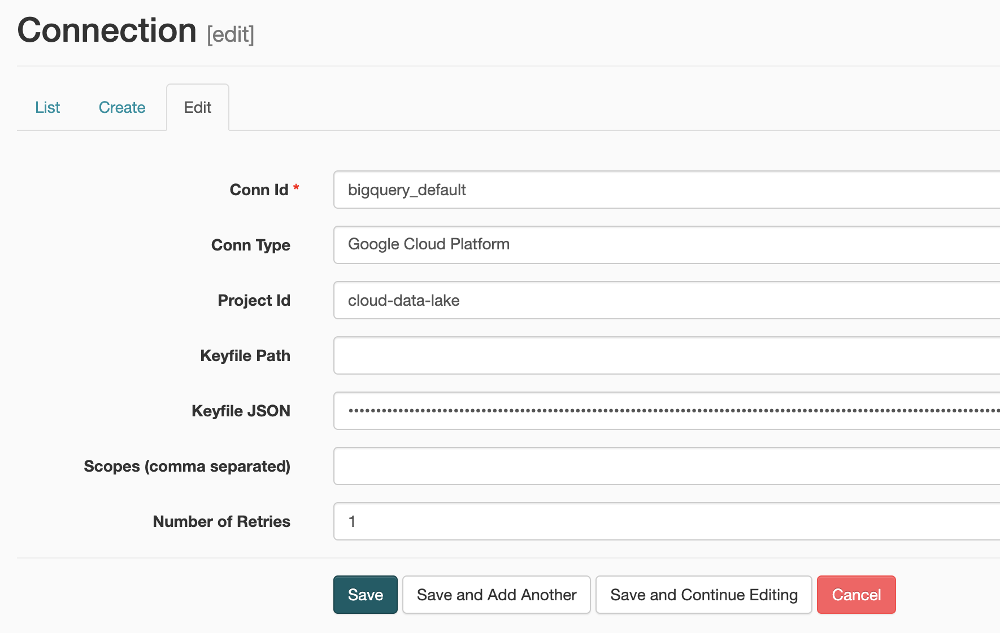

# Cloud data lake on GCP
### Project Summary
This project creates a data lake on Google Cloud Platform with main focus on building a data warehouse and data pipeline. The data lake is built around the I94 Immigration data provided by the US government. The data warehouse will help US official to analyze immigration patterns to understand what factors drive people to move.

### Project Scopes
The scope of this project will be to build a data ware house on Google Cloud Platform that will help answer common business questions as well as powering dashboards. To do that, a conceptual data model and a data pipeline will be defined.

### Data sources
* I94 Immigration Data: This data comes from the [US National Tourism and Trade Office](https://travel.trade.gov/research/reports/i94/historical/2016.html).
* I94 Data dictionary: Dictionary accompanies the I94 Immigration Data
* World Temperature Data: This dataset came from [Kaggle](https://www.kaggle.com/berkeleyearth/climate-change-earth-surface-temperature-data).
* U.S. City Demographic Data: This data comes from OpenSoft. You can read more about it [here](https://public.opendatasoft.com/explore/dataset/us-cities-demographics/export/).
* Airport Code Table: This is a simple table of airport codes and corresponding cities. It comes from [here](https://datahub.io/core/airport-codes#data).

### Architecture
Data are uploaded to Google Cloud Storage bucket. GCS will act as the data lake where all raw files are stored. Data will then be loaded to staging tables on BigQuery. The ETL process will take data from those staging tables and create data mart tables. An Airflow instance can be deployed on a Google Compute Engine or locally to orchestrate the pipeline.

Here are the justifications for the technologies used:
* Google Cloud Storage: act as the data lake, vertically scalable.
* Google Big Query: act as data base engine for data warehousing, data mart and ETL processes. BigQuery is a serverless solution that can easily and effectively process petabytes scale dataset.
* Apache Airflow: orchestrate the workflow by issuing command line to load data to BigQuery or SQL queries for ETL process. Airflow does not have to process any data by itself, thus allowing the architecture to scale.

### Data Model
The database is designed following a star-schema principal with 1 fact table and 5 dimensions tables.



* `F_IMMIGRATION_DATA`: contains immigration information such as arrival date, departure date, visa type, gender, country of origin, etc.
* `D_TIME`: contains dimensions for date column
* `D_PORT`: contains port_id and port_name
* `D_AIRPORT`: contains airports within a state
* `D_STATE`: contains state_id and state_name
* `D_COUNTRY`: contains country_id and country_name
* `D_WEATHER`: contains average weather for a state
* `D_CITY_DEMO`: contains demographic information for a city

### Data pipeline
This project uses Airflow for orchestration.



A `DummyOperator` start_pipeline kick off the pipeline followed by 4 load operations. Those operations load data from GCS bucket to BigQuery tables. The `immigration_data` is loaded as `parquet` files while the others are `csv` formatted. There are operations to check rows after loading to BigQuery.

Next the pipeline loads 3 master data object from the I94 Data dictionary. Then the `F_IMMIGRATION_DATA` table is created and check to make sure that there is no duplicates. Other dimension tables are also created and the pipelines finishes.

### Scenarios
#### Data increase by 100x
Currently infrastructure can easily supports 100x increase in data size. GCS and BigQuery can handle petabytes scale data. Airflow is not a bottle neck since it only issue commands to other services.

#### Pipelines would be run on 7am daily. how to update dashboard? would it still work?
Schedule dag to be run daily at 7 AM. Setup dag retry, email/slack notification on failures.

#### Make it available to 100+ people
BigQuery is auto-scaling so if 100+ people need to access, it can handle that easily. If more people or services need access to the database, we can add steps to write to a NoSQL database like Data Store or Cassandra, or write to a SQL one that supports horizontal scaling like BigTable.

### Project Instructions
#### GCP setup
Follow the following steps:
* Create a project on GCP
* Enable billing by adding a credit card (you have free credits worth $300)
* Navigate to IAM and create a service account
* Grant the account project owner. It is convenient for this project, but not recommended for production system. You should keep your key somewhere safe.

Create a bucket on your project and upload the data with the following structure:
```
gs://cloud-data-lake-gcp/airports/:
gs://cloud-data-lake-gcp/airports/airport-codes_csv.csv
gs://cloud-data-lake-gcp/airports/airport_codes.json

gs://cloud-data-lake-gcp/cities/:
gs://cloud-data-lake-gcp/cities/us-cities-demographics.csv
gs://cloud-data-lake-gcp/cities/us_cities_demo.json

gs://cloud-data-lake-gcp/immigration_data/:
gs://cloud-data-lake-gcp/immigration_data/part-00000-b9542815-7a8d-45fc-9c67-c9c5007ad0d4-c000.snappy.parquet
gs://cloud-data-lake-gcp/immigration_data/part-00001-b9542815-7a8d-45fc-9c67-c9c5007ad0d4-c000.snappy.parquet
gs://cloud-data-lake-gcp/immigration_data/part-00002-b9542815-7a8d-45fc-9c67-c9c5007ad0d4-c000.snappy.parquet
gs://cloud-data-lake-gcp/immigration_data/part-00003-b9542815-7a8d-45fc-9c67-c9c5007ad0d4-c000.snappy.parquet
gs://cloud-data-lake-gcp/immigration_data/part-00004-b9542815-7a8d-45fc-9c67-c9c5007ad0d4-c000.snappy.parquet
gs://cloud-data-lake-gcp/immigration_data/part-00005-b9542815-7a8d-45fc-9c67-c9c5007ad0d4-c000.snappy.parquet
gs://cloud-data-lake-gcp/immigration_data/part-00006-b9542815-7a8d-45fc-9c67-c9c5007ad0d4-c000.snappy.parquet
gs://cloud-data-lake-gcp/immigration_data/part-00007-b9542815-7a8d-45fc-9c67-c9c5007ad0d4-c000.snappy.parquet
gs://cloud-data-lake-gcp/immigration_data/part-00008-b9542815-7a8d-45fc-9c67-c9c5007ad0d4-c000.snappy.parquet
gs://cloud-data-lake-gcp/immigration_data/part-00009-b9542815-7a8d-45fc-9c67-c9c5007ad0d4-c000.snappy.parquet
gs://cloud-data-lake-gcp/immigration_data/part-00010-b9542815-7a8d-45fc-9c67-c9c5007ad0d4-c000.snappy.parquet
gs://cloud-data-lake-gcp/immigration_data/part-00011-b9542815-7a8d-45fc-9c67-c9c5007ad0d4-c000.snappy.parquet
gs://cloud-data-lake-gcp/immigration_data/part-00012-b9542815-7a8d-45fc-9c67-c9c5007ad0d4-c000.snappy.parquet
gs://cloud-data-lake-gcp/immigration_data/part-00013-b9542815-7a8d-45fc-9c67-c9c5007ad0d4-c000.snappy.parquet

gs://cloud-data-lake-gcp/master_data/:
gs://cloud-data-lake-gcp/master_data/
gs://cloud-data-lake-gcp/master_data/I94ADDR.csv
gs://cloud-data-lake-gcp/master_data/I94CIT_I94RES.csv
gs://cloud-data-lake-gcp/master_data/I94PORT.csv

gs://cloud-data-lake-gcp/weather/:
gs://cloud-data-lake-gcp/weather/GlobalLandTemperaturesByCity.csv
gs://cloud-data-lake-gcp/weather/temperature_by_city.json
```
You can copy the data to your own bucket by running the following:
```
gsutil cp -r gs://cloud-data-lake-gcp/ gs://{your_bucket_name}
```
#### Local setup
Clone the project, create environment, install required packages by running the following:

```
git clone https://github.com/tuanchris/cloud-data-lake
conda create --name cloud-data-lake python=3.7
conda activate cloud-data-lake
cd cloud-data-lake
pip install --user -r requirements.txt
```

Install docker if it's not already installed. You can find the resources to do that [here](https://docs.docker.com/install/). Run the following commands to bring up the Airflow instance:
```
make run
```
You can look at the logs by running `make logs` if you need to debug something. You can access and manage the pipeline by typing the following address to a browser:
```
localhost/admin/
```
If everything is setup correctly, you will see the following screen:



Navigate to Admin -> Connections and paste in the credentials for the following two connections: `bigquery_default` and `google_cloud_default`



Navigate to the main dag on path `dags\cloud-data-lake-pipeline.py` and
change the following parameters with your own setup:

```
project_id = 'cloud-data-lake'
staging_dataset = 'IMMIGRATION_DWH_STAGING'
dwh_dataset = 'IMMIGRATION_DWH'
gs_bucket = 'cloud-data-lake-gcp'
```

You can then trigger the dag and the pipeline will run.

### The data warehouse
The final data warehouse looks like this:

